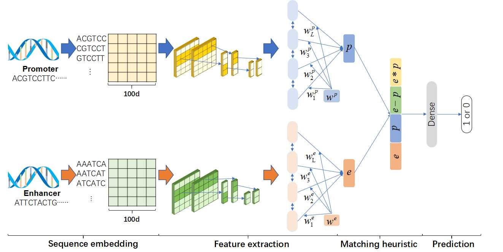

# EP-DLMH

This is our implementation for the paper:

> Predicting Enhancer-Promoter Interactions by Deep Learning and Matching Heuristic


Figure1 shows the Architecture of the model.
It consists of four steps, including Sequence embedding, Feature extraction, Matching heuristic, and Prediction.

# Dataset

Due to size limitations, we only provide GM12878 dataset in data/GM12878.

# File Description

- Data_Augmentation.R

  A tool of data augmentation provided by Mao et al. (2017). The details of the tool can be seen in https://github.com/wgmao/EPIANN.

- sequence_processing.py

  Used for pre-processing DNA sequences

- embedding_matrix.npy

  The weight of the embedding layer converted from the pre-trained DNA vector provided by Ng (2017).

- train.py, train*c*-.py, train_c_x.py, train_max.py

  Used for training all EP-DLMH models

- test.py

  Evaluate the performance of models.

# Usage

```bash
1.python sequence_processing.py
2.python train.py
3.python test.py
```
